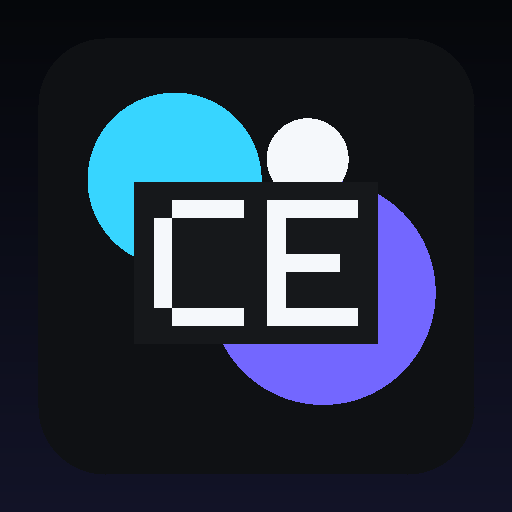

<p align="center"></p>

# Cenacolocristore

**Every Call. Connected by Design.**

A modern commerce brand designed around products, collections, customer experience, and digital discovery.

> **A communications platform experience designed around clear call flows, programmable control, developer workflows, support, and operational visibility.**

---

## Overview

Cenacolocristore is represented as a complete digital system: brand identity, product architecture, support, documentation, developer experience, trust, resources, policies, and a production-oriented GitHub Pages website.

## Core Capabilities

- **Voice Platform** — Voice Platform is treated as part of the complete Cenacolocristore experience — designed to clarify the system while keeping the experience clear, useful, and maintainable.
- **Connectivity** — Connectivity is treated as part of the complete Cenacolocristore experience — designed to strengthen the system while keeping the experience clear, useful, and maintainable.
- **Numbers & Routing** — Numbers & Routing is treated as part of the complete Cenacolocristore experience — designed to clarify the system while keeping the experience clear, useful, and maintainable.
- **Automation** — Automation is treated as part of the complete Cenacolocristore experience — designed to simplify the system while keeping the experience clear, useful, and maintainable.
- **Messaging** — Messaging is treated as part of the complete Cenacolocristore experience — designed to organize the system while keeping the experience clear, useful, and maintainable.
- **Contact Center** — Contact Center is treated as part of the complete Cenacolocristore experience — designed to clarify the system while keeping the experience clear, useful, and maintainable.
- **Developer Experience** — Developer Experience is treated as part of the complete Cenacolocristore experience — designed to simplify the system while keeping the experience clear, useful, and maintainable.
- **Trust & Operations** — Trust & Operations is treated as part of the complete Cenacolocristore experience — designed to connect the system while keeping the experience clear, useful, and maintainable.

## Communications Platform Architecture

Cenacolocristore is structured as a programmable communications platform experience rather than a generic technology landing page.

```text
Applications / Users
        ↓
Voice API · SIP · Numbers · Messaging
        ↓
Routing · IVR · Automation · Webhooks
        ↓
Communications Provider Layer
        ↓
PSTN / SIP Destinations
        ↓
Events · Analytics · Support · Operations
```

### Voice Product Surface

- Programmable Voice
- SIP Trunking
- Phone Numbers
- Messaging
- Call Routing
- IVR & Call Flows
- Call Recording
- Contact Center
- AI Voice & Automation
- Voice Analytics
- Developer APIs
- Webhooks and integrations

## Telnyx Setup Boundary

The repository includes a Telnyx-oriented setup guide for account configuration, webhooks, and voice architecture. Identity verification, account approval, phone-number purchases, credentials, regulatory requirements, and production configuration remain inside the official Telnyx account.

**Never commit Telnyx API keys, GitHub tokens, passwords, or private account credentials to this repository.**


## Operating Principles

- **Connectivity** — part of the core brand direction.
- **Clarity** — part of the core brand direction.
- **Control** — part of the core brand direction.
- **Reliability** — part of the core brand direction.

## Website Standard

The website is generated for GitHub Pages with responsive layouts, local branded imagery, accessible navigation, SEO metadata, structured data, search, a sitemap, robots.txt, a web manifest, product pages, developer pages, support infrastructure, trust content, policies, and automated validation.

Website: https://cenacolocristore.github.io/

## Support

- Support Center: https://cenacolocristore.github.io/support.html
- Support phone: +1 239 381 8774
- Sales phone: +1 239 381 8774
- Availability: 9:00 - 9:59
- GitHub: https://github.com/cenacolocristore

> Connected-account email addresses are private by default and are never copied into the public website automatically.

## Repository Ecosystem

```text
cenacolocristore
cenacolocristore.github.io
```

## Brand Assets

- `brand/profile-avatar.png` — 512×512 PNG generated below GitHub's 1 MB profile-picture limit.
- `brand/logo.svg` — scalable brand mark.
- `brand/visual-hero.svg` — local branded hero artwork.
- `brand/brand.json` — machine-readable brand metadata.

## Privacy & Secret Safety

BrandForge V12 runs a publication gate that looks for account-email leakage and common secret patterns before publishing. Provider keys and GitHub credentials belong in secure server-side secrets, not HTML, client-side JavaScript, README files, or public repositories.

## Publishing Standard

Public claims should remain accurate and verifiable. BrandForge does not invent customers, testimonials, awards, certifications, business locations, product inventory, pricing, service guarantees, carrier coverage, uptime, call volume, or social accounts.

---

© 2026 Cenacolocristore. All rights reserved.
